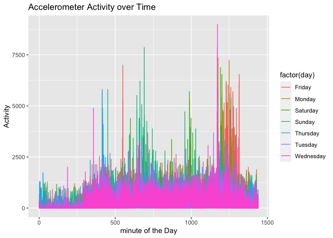
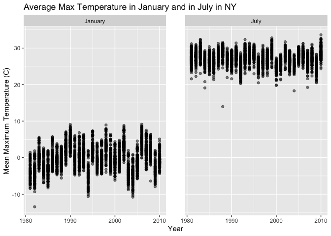
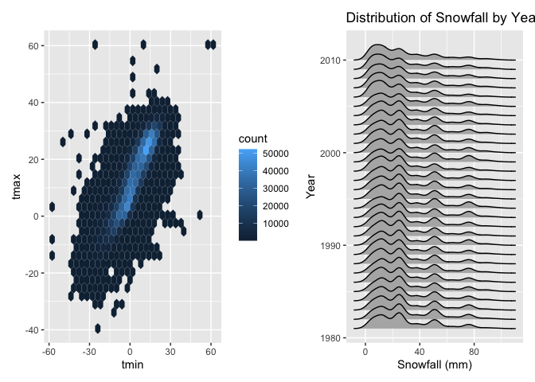

Homework 3
================
Zaynub Ibrahim

### Problem 1

``` r
library(tidyverse)
```

    ## ── Attaching packages ───────────────────────────────────────────────────────────────────────────── tidyverse 1.3.0 ──

    ## ✓ ggplot2 3.3.2     ✓ purrr   0.3.4
    ## ✓ tibble  3.0.3     ✓ dplyr   1.0.2
    ## ✓ tidyr   1.1.2     ✓ stringr 1.4.0
    ## ✓ readr   1.3.1     ✓ forcats 0.5.0

    ## ── Conflicts ──────────────────────────────────────────────────────────────────────────────── tidyverse_conflicts() ──
    ## x dplyr::filter() masks stats::filter()
    ## x dplyr::lag()    masks stats::lag()

``` r
library(p8105.datasets)
library(patchwork)
library(ggridges)
data("instacart")
```

This dataset contains 1384617 rows and 15 columns.

Observations are the level of items in orders by user. There are user /
order variables – user ID, order ID, order day, and order hour. There
are also item variables – name, aisle, department, and some numeric
code. The data set shows an order number, and how long it has been since
the order was placed and also shows the item that is ordered and which
aisle and department it is located in.

How many aisles, and which are most items from?

``` r
instacart %>%
  count(aisle) %>%
  arrange(desc(n))
```

    ## # A tibble: 134 x 2
    ##    aisle                              n
    ##    <chr>                          <int>
    ##  1 fresh vegetables              150609
    ##  2 fresh fruits                  150473
    ##  3 packaged vegetables fruits     78493
    ##  4 yogurt                         55240
    ##  5 packaged cheese                41699
    ##  6 water seltzer sparkling water  36617
    ##  7 milk                           32644
    ##  8 chips pretzels                 31269
    ##  9 soy lactosefree                26240
    ## 10 bread                          23635
    ## # … with 124 more rows

Make a plot that shows the number of items ordered in each aisle:

``` r
instacart %>%
  count(aisle) %>%
  filter(n > 10000) %>%
  mutate(
    aisle = factor(aisle),
    aisle = fct_reorder(aisle, n)
  ) %>%
  ggplot(aes(x = aisle, y = n)) +
  geom_point() +
  theme(axis.text.x = element_text(angle = 90, vjust = 0.5, hjust = 1))
```

<!-- -->

Make a table that shows most popular items in “baking ingredients”, “dog
food care”, and “packaged vegetables fruits” aisles.

``` r
instacart %>%
  filter(aisle %in% c("baking ingredients", "dog food care", "packaged vegetables fruits")) %>%
  group_by(aisle) %>%
  count(product_name) %>%
  mutate(rank = min_rank(desc(n))) %>%
  filter(rank < 4) %>%
  arrange(aisle, rank) %>%
  knitr::kable()
```

| aisle                      | product\_name                                 |    n | rank |
| :------------------------- | :-------------------------------------------- | ---: | ---: |
| baking ingredients         | Light Brown Sugar                             |  499 |    1 |
| baking ingredients         | Pure Baking Soda                              |  387 |    2 |
| baking ingredients         | Cane Sugar                                    |  336 |    3 |
| dog food care              | Snack Sticks Chicken & Rice Recipe Dog Treats |   30 |    1 |
| dog food care              | Organix Chicken & Brown Rice Recipe           |   28 |    2 |
| dog food care              | Small Dog Biscuits                            |   26 |    3 |
| packaged vegetables fruits | Organic Baby Spinach                          | 9784 |    1 |
| packaged vegetables fruits | Organic Raspberries                           | 5546 |    2 |
| packaged vegetables fruits | Organic Blueberries                           | 4966 |    3 |

Make a table showing the mean hour of the day at which Pink Lady Apples
and Coffee Ice Cream are ordered on each day of the week.

``` r
instacart %>%
  filter(product_name %in% c("Pink Lady Apples", "Coffee Ice Cream")) %>%
  group_by(product_name, order_dow) %>%
  summarize(mean_hour = mean(order_hour_of_day)) %>%
  pivot_wider(
    names_from = order_dow,
    values_from = mean_hour
  )
```

    ## `summarise()` regrouping output by 'product_name' (override with `.groups` argument)

    ## # A tibble: 2 x 8
    ## # Groups:   product_name [2]
    ##   product_name       `0`   `1`   `2`   `3`   `4`   `5`   `6`
    ##   <chr>            <dbl> <dbl> <dbl> <dbl> <dbl> <dbl> <dbl>
    ## 1 Coffee Ice Cream  13.8  14.3  15.4  15.3  15.2  12.3  13.8
    ## 2 Pink Lady Apples  13.4  11.4  11.7  14.2  11.6  12.8  11.9

### Problem 2

Read and Tidy accel\_data:

``` r
accel_df = read_csv(file = "./data/accel_data.csv") %>% 
  pivot_longer(
    activity.1:activity.1440,
    names_to = "minute",
    names_prefix = "activity.",
    values_to = "activity"
  ) %>% 
  group_by(day) %>% 
  mutate(
    minute = as.numeric(minute),
    day = as.factor(day),
    activity = as.numeric(activity),
    day = forcats::fct_relevel(day, c("Sunday", "Monday", "Tuesday", "Wednesday", "Thursday", "Friday", "Saturday")),
    weekday_or_weekend =  if_else(day %in% c("Saturday", "Sunday"), "Weekend", "Weekday")
  )
```

    ## Parsed with column specification:
    ## cols(
    ##   .default = col_double(),
    ##   day = col_character()
    ## )

    ## See spec(...) for full column specifications.

    ## Warning: Problem with `mutate()` input `day`.
    ## ℹ Unknown levels in `f`: Sunday, Monday, Tuesday, Wednesday, Thursday, Saturday
    ## ℹ Input `day` is `forcats::fct_relevel(...)`.
    ## ℹ The error occurred in group 1: day = "Friday".

    ## Warning: Unknown levels in `f`: Sunday, Monday, Tuesday, Wednesday, Thursday,
    ## Saturday

    ## Warning: Problem with `mutate()` input `day`.
    ## ℹ Unknown levels in `f`: Sunday, Tuesday, Wednesday, Thursday, Friday, Saturday
    ## ℹ Input `day` is `forcats::fct_relevel(...)`.
    ## ℹ The error occurred in group 2: day = "Monday".

    ## Warning: Unknown levels in `f`: Sunday, Tuesday, Wednesday, Thursday, Friday,
    ## Saturday

    ## Warning: Problem with `mutate()` input `day`.
    ## ℹ Unknown levels in `f`: Sunday, Monday, Tuesday, Wednesday, Thursday, Friday
    ## ℹ Input `day` is `forcats::fct_relevel(...)`.
    ## ℹ The error occurred in group 3: day = "Saturday".

    ## Warning: Unknown levels in `f`: Sunday, Monday, Tuesday, Wednesday, Thursday,
    ## Friday

    ## Warning: Problem with `mutate()` input `day`.
    ## ℹ Unknown levels in `f`: Monday, Tuesday, Wednesday, Thursday, Friday, Saturday
    ## ℹ Input `day` is `forcats::fct_relevel(...)`.
    ## ℹ The error occurred in group 4: day = "Sunday".

    ## Warning: Unknown levels in `f`: Monday, Tuesday, Wednesday, Thursday, Friday,
    ## Saturday

    ## Warning: Problem with `mutate()` input `day`.
    ## ℹ Unknown levels in `f`: Sunday, Monday, Tuesday, Wednesday, Friday, Saturday
    ## ℹ Input `day` is `forcats::fct_relevel(...)`.
    ## ℹ The error occurred in group 5: day = "Thursday".

    ## Warning: Unknown levels in `f`: Sunday, Monday, Tuesday, Wednesday, Friday,
    ## Saturday

    ## Warning: Problem with `mutate()` input `day`.
    ## ℹ Unknown levels in `f`: Sunday, Monday, Wednesday, Thursday, Friday, Saturday
    ## ℹ Input `day` is `forcats::fct_relevel(...)`.
    ## ℹ The error occurred in group 6: day = "Tuesday".

    ## Warning: Unknown levels in `f`: Sunday, Monday, Wednesday, Thursday, Friday,
    ## Saturday

    ## Warning: Problem with `mutate()` input `day`.
    ## ℹ Unknown levels in `f`: Sunday, Monday, Tuesday, Thursday, Friday, Saturday
    ## ℹ Input `day` is `forcats::fct_relevel(...)`.
    ## ℹ The error occurred in group 7: day = "Wednesday".

    ## Warning: Unknown levels in `f`: Sunday, Monday, Tuesday, Thursday, Friday,
    ## Saturday

This tidy accel\_df dataset contains five weeks of accelerometer data
collected on a 63 year-old male with BMI 25, who was admitted to the
Advanced Cardiac Care Center of Columbia University Medical Center and
diagnosed with congestive heart failure (CHF). It has 50400 rows and 6
and contains variables week, day\_id, day, minute, activity,
weekday\_or\_weekend.

Now I am creating a table to show total activity variable for each day.

``` r
accel_df %>% 
  group_by(week, day) %>% 
  summarize(aggregate_activity = sum(activity)) %>% 
  knitr::kable()
```

    ## `summarise()` regrouping output by 'week' (override with `.groups` argument)

| week | day       | aggregate\_activity |
| ---: | :-------- | ------------------: |
|    1 | Friday    |           480542.62 |
|    1 | Monday    |            78828.07 |
|    1 | Saturday  |           376254.00 |
|    1 | Sunday    |           631105.00 |
|    1 | Thursday  |           355923.64 |
|    1 | Tuesday   |           307094.24 |
|    1 | Wednesday |           340115.01 |
|    2 | Friday    |           568839.00 |
|    2 | Monday    |           295431.00 |
|    2 | Saturday  |           607175.00 |
|    2 | Sunday    |           422018.00 |
|    2 | Thursday  |           474048.00 |
|    2 | Tuesday   |           423245.00 |
|    2 | Wednesday |           440962.00 |
|    3 | Friday    |           467420.00 |
|    3 | Monday    |           685910.00 |
|    3 | Saturday  |           382928.00 |
|    3 | Sunday    |           467052.00 |
|    3 | Thursday  |           371230.00 |
|    3 | Tuesday   |           381507.00 |
|    3 | Wednesday |           468869.00 |
|    4 | Friday    |           154049.00 |
|    4 | Monday    |           409450.00 |
|    4 | Saturday  |             1440.00 |
|    4 | Sunday    |           260617.00 |
|    4 | Thursday  |           340291.00 |
|    4 | Tuesday   |           319568.00 |
|    4 | Wednesday |           434460.00 |
|    5 | Friday    |           620860.00 |
|    5 | Monday    |           389080.00 |
|    5 | Saturday  |             1440.00 |
|    5 | Sunday    |           138421.00 |
|    5 | Thursday  |           549658.00 |
|    5 | Tuesday   |           367824.00 |
|    5 | Wednesday |           445366.00 |

No apparent trends stand out just from looking at this aggregate table.
However, it is interesting to note that the level of activity on the
last two Saturdays was significantly lower than any of the other days.

Next, I am creating a plot that shows the 24-hour activity time courses
for each day.

``` r
accel_df %>% 
  ggplot(aes(x = minute, y = activity, color = factor(day))) +
  geom_line() +
  labs(
    title = "Accelerometer Activity over Time",
    x = "minute of the Day",
    y = "Activity"
  ) 
```

<!-- -->

The graph shows that there seems to be more consistently higher levels
of activity on Thursdays and Sundays. Even though Wedenesday shows the
consistently lowest levels of activity, there is one Wednesday where the
max level of activity was recorded. On Fridays, he tends to be more
active later in the day while on Thursday and Sunday, he is more active
earlier in the day.

### Problem 3

Load the dataset:

``` r
data("ny_noaa")
```

This dataset contains 2595176 rows and 7 columns and includes variables
id, date, prcp, snow, snwd, tmax, tmin. This data contains information
on weather in NY and includes snowfall and snow depth in mm,
precipitation in tenths of a mm, as well as the max and min temperature
in tenths of degrees C. There is a lot of missing data since each
weather station can only collect information on a subset of these
variables on any given day.

Tidy the data:

``` r
noaa_df <- ny_noaa %>%
  separate(date, sep = "-", into = c("year", "month", "day"), convert = TRUE) %>%
  mutate( 
    prcp = prcp/10,
    tmax = as.numeric(tmax),
    tmin = as.numeric(tmin), 
    tmax = tmax/10,
    tmin = tmin/10)

ny_noaa %>%
  count(snow) %>%
  arrange(desc(n))
```

    ## # A tibble: 282 x 2
    ##     snow       n
    ##    <int>   <int>
    ##  1     0 2008508
    ##  2    NA  381221
    ##  3    25   31022
    ##  4    13   23095
    ##  5    51   18274
    ##  6    76   10173
    ##  7     8    9962
    ##  8     5    9748
    ##  9    38    9197
    ## 10     3    8790
    ## # … with 272 more rows

For snowfall, the most commonly observed values are 0 mm and NA. This
makes sense since most of the days in the year it is not snowing, and
even in the winter, there isn’t always snowfall.

Next I am creating a two-panel plot showing the average max temperature
in January and in July in each station across years:

``` r
month.labs <- c("January", "July")
names(month.labs) <- as.numeric(c("1", "7"))

noaa_df %>% 
  group_by(id, year, month) %>% 
  filter(month == 1 | month == 7, na.rm = TRUE) %>% 
  summarize(
    mean_tmax = mean(tmax)
  )  %>% 
  ggplot(aes(x = year, y = mean_tmax, group = id)) + 
    geom_point(alpha = .5) +
    geom_smooth() +
    facet_grid(. ~ month,
               labeller = labeller(month = month.labs)) +
  theme(panel.spacing = unit(2, "lines")) +
  labs(
    title = "Average Max Temperature in January and in July in NY",
    x = "Year",
    y = "Mean Maximum Temperature (C)"
  )
```

    ## `summarise()` regrouping output by 'id', 'year' (override with `.groups` argument)

    ## `geom_smooth()` using method = 'loess' and formula 'y ~ x'

    ## Warning: Removed 7058 rows containing non-finite values (stat_smooth).

    ## Warning in simpleLoess(y, x, w, span, degree = degree, parametric =
    ## parametric, : Chernobyl! trL>n 6
    
    ## Warning in simpleLoess(y, x, w, span, degree = degree, parametric =
    ## parametric, : Chernobyl! trL>n 6

    ## Warning in sqrt(sum.squares/one.delta): NaNs produced

    ## Warning in stats::qt(level/2 + 0.5, pred$df): NaNs produced

    ## Warning in simpleLoess(y, x, w, span, degree = degree, parametric =
    ## parametric, : span too small. fewer data values than degrees of freedom.

    ## Warning in simpleLoess(y, x, w, span, degree = degree, parametric =
    ## parametric, : at 2009

    ## Warning in simpleLoess(y, x, w, span, degree = degree, parametric =
    ## parametric, : radius 2.5e-05

    ## Warning in simpleLoess(y, x, w, span, degree = degree, parametric =
    ## parametric, : all data on boundary of neighborhood. make span bigger

    ## Warning in simpleLoess(y, x, w, span, degree = degree, parametric =
    ## parametric, : pseudoinverse used at 2009

    ## Warning in simpleLoess(y, x, w, span, degree = degree, parametric =
    ## parametric, : neighborhood radius 0.005

    ## Warning in simpleLoess(y, x, w, span, degree = degree, parametric =
    ## parametric, : reciprocal condition number 1

    ## Warning in simpleLoess(y, x, w, span, degree = degree, parametric =
    ## parametric, : at 2010

    ## Warning in simpleLoess(y, x, w, span, degree = degree, parametric =
    ## parametric, : radius 2.5e-05

    ## Warning in simpleLoess(y, x, w, span, degree = degree, parametric =
    ## parametric, : all data on boundary of neighborhood. make span bigger

    ## Warning in simpleLoess(y, x, w, span, degree = degree, parametric =
    ## parametric, : There are other near singularities as well. 2.5e-05

    ## Warning in simpleLoess(y, x, w, span, degree = degree, parametric =
    ## parametric, : zero-width neighborhood. make span bigger
    
    ## Warning in simpleLoess(y, x, w, span, degree = degree, parametric =
    ## parametric, : zero-width neighborhood. make span bigger

    ## Warning: Computation failed in `stat_smooth()`:
    ## NA/NaN/Inf in foreign function call (arg 5)

    ## Warning in simpleLoess(y, x, w, span, degree = degree, parametric =
    ## parametric, : span too small. fewer data values than degrees of freedom.

    ## Warning in simpleLoess(y, x, w, span, degree = degree, parametric =
    ## parametric, : at 1987

    ## Warning in simpleLoess(y, x, w, span, degree = degree, parametric =
    ## parametric, : radius 2.5e-05

    ## Warning in simpleLoess(y, x, w, span, degree = degree, parametric =
    ## parametric, : all data on boundary of neighborhood. make span bigger

    ## Warning in simpleLoess(y, x, w, span, degree = degree, parametric =
    ## parametric, : pseudoinverse used at 1987

    ## Warning in simpleLoess(y, x, w, span, degree = degree, parametric =
    ## parametric, : neighborhood radius 0.005

    ## Warning in simpleLoess(y, x, w, span, degree = degree, parametric =
    ## parametric, : reciprocal condition number 1

    ## Warning in simpleLoess(y, x, w, span, degree = degree, parametric =
    ## parametric, : at 1988

    ## Warning in simpleLoess(y, x, w, span, degree = degree, parametric =
    ## parametric, : radius 2.5e-05

    ## Warning in simpleLoess(y, x, w, span, degree = degree, parametric =
    ## parametric, : all data on boundary of neighborhood. make span bigger

    ## Warning in simpleLoess(y, x, w, span, degree = degree, parametric =
    ## parametric, : There are other near singularities as well. 2.5e-05

    ## Warning in simpleLoess(y, x, w, span, degree = degree, parametric =
    ## parametric, : zero-width neighborhood. make span bigger
    
    ## Warning in simpleLoess(y, x, w, span, degree = degree, parametric =
    ## parametric, : zero-width neighborhood. make span bigger

    ## Warning: Computation failed in `stat_smooth()`:
    ## NA/NaN/Inf in foreign function call (arg 5)

    ## Warning: Removed 7058 rows containing missing values (geom_point).

<!-- -->

These plots show that average max temps in January are much lower than
average max temps in July as is expected. There is one outlier in each
graph. In January 1982 it seems there was a January that was
significantly colder than the other years, while in July 1987, there was
also a lower recorded temperature than usual.

Next I am making a plot that shows tmax vs. tmin for the full dataset:

``` r
tmax_tmin_p = 
  noaa_df %>% 
  ggplot(aes(x = tmin, y = tmax)) +
  geom_hex()

snowfall_p = 
  noaa_df %>% 
  filter(snow > 0 & snow < 100, na.rm = TRUE) %>% 
  group_by(year) %>% 
  ggplot(aes(x = snow, y = year, group = year)) +
    geom_density_ridges() +
    labs(
      title = "Distribution of Snowfall by Year",
      x = "Snowfall (mm)",
      y = "Year"
    )

(tmax_tmin_p + snowfall_p)
```

    ## Warning: Removed 1136276 rows containing non-finite values (stat_binhex).

    ## Picking joint bandwidth of 3.76

<!-- -->
